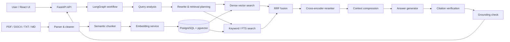
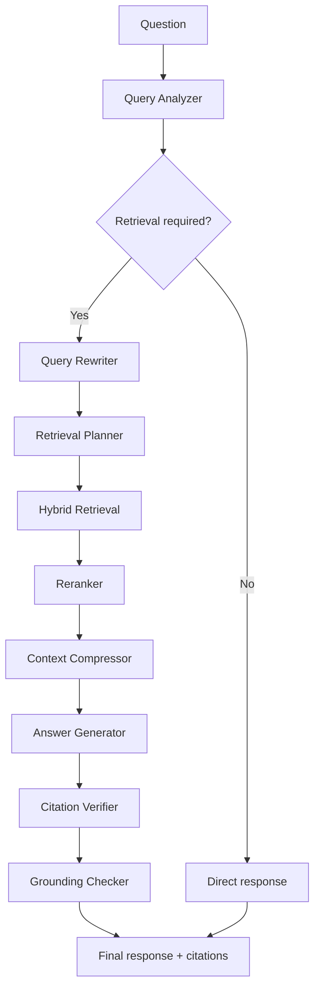

# NexusRAG — Agentic Knowledge Intelligence Platform

> A production-oriented Agentic RAG application for grounded answers over private documents, combining hybrid retrieval, reranking, citations, and answer-grounding checks.

[](https://www.python.org/) [](https://fastapi.tiangolo.com/) [](https://react.dev/) [](https://github.com/pgvector/pgvector)

NexusRAG ingests PDFs, DOCX files, Markdown, and text files into a searchable knowledge base. Rather than a basic “vector search → LLM” demo, each question runs through an explicit workflow: query classification, retrieval planning, hybrid evidence retrieval, reranking, answer generation, citation verification, and grounding validation.

It is designed as an AI Engineer portfolio project: the retrieval and reliability decisions are visible in the codebase, measured in evaluation, and surfaced in the UI.

## What it demonstrates

- **Real document ingestion:** format-specific parsing, metadata extraction, semantic chunking, embeddings, indexing, and document lifecycle status.
- **Agentic retrieval:** query routing for factual, comparison, multi-document, analytical, summarization, and conversational questions.
- **Hybrid search:** semantic/vector retrieval and PostgreSQL full-text search, fused with Reciprocal Rank Fusion (RRF).
- **Precision layer:** cross-encoder reranking with a deterministic heuristic alternative for offline development.
- **Grounded answers:** citations are produced from retrieved chunks, validated, and passed through a grounding check before the final response.
- **Production-shaped engineering:** FastAPI, typed schemas, repository/service separation, async SQLAlchemy, structured logs, Docker Compose, tests, and evaluation.
- **Evidence-first UI:** streaming chat, citations, document viewer, raw evidence search, evaluation, and latency/strategy observability.

## Architecture



### Agent workflow



## Features

### Knowledge ingestion

- Upload and validate PDF, DOCX, TXT, and Markdown files.
- Extract PDF text with PyMuPDF and DOCX content with `python-docx`.
- Preserve source filename, page number, section, character offsets, document hash, timestamps, and chunk metadata.
- Configure chunk size, overlap, and separators.
- Store embeddings in PostgreSQL + pgvector; SQLite is also available for lightweight local demos.
- Browse document metadata, status, extracted chunks, and source evidence in the frontend.

### Retrieval and generation

- Dense/vector and lexical/keyword retrieval.
- Reciprocal Rank Fusion (RRF) to merge result lists without forcing incomparable score scales together.
- Cross-encoder reranking to improve top-context precision.
- Configurable retrieval top-k, embedding model, reranker model, and grounding threshold.
- OpenAI-compatible LLM interface with OpenAI, Groq, Ollama, and mock provider configuration.
- SSE streaming endpoint that emits workflow status, tokens, citations, and completion events.

### Evaluation and observability

- Evaluation dataset and benchmark runner.
- Retrieval Recall, Precision@K, MRR, citation correctness, context relevance, faithfulness, answer relevance, and latency-oriented metrics.
- Retrieval logs include query strategy, selected chunks, retrieval/reranking latency, LLM latency, and total latency.
- Dashboard and analytics views display document counts, indexed chunks, query volume, query routing, recent requests, and latency data.

## Technology choices

| Layer | Technology | Reason |
|---|---|---|
| API | FastAPI + Pydantic v2 | Async APIs, typed validation, and automatic OpenAPI documentation. |
| Orchestration | LangGraph | Makes routing, retrieval, and verification workflow nodes explicit and testable. |
| Storage | PostgreSQL + pgvector | Keeps document metadata and vector search in one operational database. |
| Retrieval | Dense + keyword search + RRF | Balances semantic recall with exact-term coverage. |
| Reranking | Cross-encoder | Scores query–chunk pairs after broad retrieval to improve precision. |
| Frontend | React, TypeScript, Vite, Tailwind | Fast, type-safe development of a modern evidence-first product UI. |
| Test stack | pytest + pytest-asyncio | Covers the agent workflow, retrieval, parsers, citations, APIs, and evaluation. |

## Repository structure

```text
.
├── backend/
│   ├── app/
│   │   ├── agents/          # LangGraph state, nodes, prompts, workflow
│   │   ├── api/             # FastAPI routers and dependencies
│   │   ├── db/              # Async SQLAlchemy session and initialization
│   │   ├── evaluation/      # Dataset, metrics, benchmark runner
│   │   ├── ingestion/       # Parsers and semantic chunker
│   │   ├── models/          # Database models
│   │   ├── repositories/    # Data access layer
│   │   ├── retrieval/       # Vector, keyword, fusion, reranking logic
│   │   └── services/        # Embedding, LLM, ingestion services
│   └── tests/
├── frontend/src/
│   ├── components/
│   ├── pages/
│   ├── services/
│   └── types/
├── sample_data/             # Ready-to-ingest demonstration corpus
├── scripts/ingest_samples.py
├── docker-compose.yml
└── .env.example
```

## Run with Docker (recommended)

### Prerequisite

Install [Docker Desktop](https://www.docker.com/products/docker-desktop/).

### Start

```powershell
git clone <your-repository-url>
Set-Location rag-project
docker compose up --build
```

| Service | URL |
|---|---|
| NexusRAG frontend | http://localhost:5173 |
| FastAPI docs | http://localhost:8000/docs |
| API health | http://localhost:8000/api/v1/health |

The Docker stack defaults to `LLM_PROVIDER=mock`, allowing the UI and retrieval pipeline to be explored without an API key. The first start can take several minutes while local embedding/reranking models download.

To use an LLM, copy the template first:

```powershell
Copy-Item .env.example .env
```

Then set at least the following values in `.env`:

```env
LLM_PROVIDER="openai"
LLM_MODEL="gpt-4o-mini"
LLM_API_KEY="your-api-key"
LLM_BASE_URL="https://api.openai.com/v1"
```

Stop the stack while preserving data:

```powershell
docker compose down
```

## Run locally

Prerequisites: Python 3.12+ (Python 3.13 also works), Node.js 20+, and optionally PostgreSQL + pgvector.

### 1. Configure an offline demo

```powershell
Copy-Item .env.example .env
```

For a standalone local setup, edit `.env`:

```env
DATABASE_URL="sqlite+aiosqlite:///./nexusrag.db"
LLM_PROVIDER="mock"
EMBEDDING_PROVIDER="mock"
RERANKER_TYPE="heuristic"
```

### 2. Start the backend

```powershell
python -m pip install -r backend/requirements.txt
Set-Location backend
python -m uvicorn app.main:app --reload --port 8000
```

### 3. Start the frontend in another terminal

```powershell
Set-Location frontend
npm install
npm run dev
```

Open http://localhost:5173. Vite proxies `/api` calls to port `8000`.

### 4. Load demo data

Upload files from `sample_data/` in **Knowledge Base**, or run this command from the repository root:

```powershell
python scripts/ingest_samples.py
```

## Demo walkthrough

1. Ingest the sample documents through the UI or ingestion script.
2. Open **AI Chat** and ask a question from the examples below.
3. Review the workflow progress, streamed answer, and citations.
4. Open **Evidence Search** to inspect raw hybrid retrieval results.
5. Open **Analytics** to inspect strategy and latency telemetry.
6. Run **Evaluation** after the sample corpus has been indexed.

### Example questions

| Capability | Prompt |
|---|---|
| Factual retrieval | `What is reciprocal rank fusion and why is it useful in hybrid retrieval?` |
| Summarization | `Summarize the recommended practices for reliable AI systems.` |
| Comparison | `Compare the architectural trade-offs described for distributed systems and RAG systems.` |
| Multi-document reasoning | `What reliability practices are shared between the AI systems and distributed systems documents?` |
| Evidence boundary | `What does the knowledge base say about quantum computing?` |

The final question is deliberately outside the sample corpus and should result in an evidence-limited response instead of an unsupported answer.

## API

Endpoints are exposed under both `/api/v1` and `/api`.

| Method | Endpoint | Purpose |
|---|---|---|
| `POST` | `/documents/upload` | Upload and index a document. |
| `GET` | `/documents` | List documents. |
| `GET` | `/documents/{id}` | Get document metadata and chunks. |
| `DELETE` | `/documents/{id}` | Delete a document and its chunks. |
| `POST` | `/chat` | Run the full agent workflow. |
| `POST` | `/chat/stream` | Stream workflow events, tokens, and citations over SSE. |
| `POST` | `/search` | Run hybrid retrieval without answer generation. |
| `GET` | `/conversations` | List conversations. |
| `GET` | `/stats` | Read operational metrics. |
| `GET` | `/health` | Read application health and active configuration. |
| `POST` | `/evaluation/run` | Run the evaluation benchmark. |

Use `http://localhost:8000/docs` for interactive API documentation.

## Tests, evaluation, and builds

```powershell
# Backend test suite
Set-Location backend
python -m pytest -q

# Lint (installed through backend/requirements.txt)
python -m ruff check app tests

# RAG benchmark
python -m app.evaluation.run

# Frontend type check and production build
Set-Location ../frontend
npm run build
```

## Configuration

The full configuration is documented in `.env.example`.

| Variable | Purpose |
|---|---|
| `DATABASE_URL` | Async PostgreSQL/pgvector URL, or SQLite for a lightweight demo. |
| `LLM_PROVIDER` | `openai`, `groq`, `ollama`, or `mock`. |
| `LLM_MODEL`, `LLM_API_KEY`, `LLM_BASE_URL` | OpenAI-compatible generation configuration. |
| `EMBEDDING_PROVIDER`, `EMBEDDING_MODEL` | Embedding model configuration. |
| `RERANKER_TYPE`, `RERANKER_MODEL` | Cross-encoder or heuristic reranking configuration. |
| `RETRIEVAL_TOP_K`, `RRF_K` | Retrieval candidate and fusion tuning. |
| `CHUNK_SIZE`, `CHUNK_OVERLAP` | Chunking configuration. |
| `GROUNDING_THRESHOLD` | Minimum support threshold used by answer validation. |

Never commit `.env` or credentials; `.env` is ignored by Git.

## Limitations and next steps

- Authentication and user/workspace-level document isolation are outside the scope of this local portfolio build.
- Ingestion runs in-process; production ingestion should run through durable background workers.
- The supplied evaluation dataset is deliberately small; a real deployment requires task-specific human-labelled evaluation data.
- pgvector index parameters and capacity should be tuned against the intended corpus and query load.

## Interview discussion points

- **Why hybrid retrieval?** Dense retrieval helps semantic recall; keyword retrieval protects exact terms, identifiers, and rare vocabulary. RRF is robust when the two systems produce differently scaled scores.
- **Why an agent graph?** Query intent changes the appropriate retrieval strategy. Modeling the workflow as nodes keeps planning, retrieval, generation, and verification separately inspectable and testable.
- **How is hallucination reduced?** The response is built from retrieved chunks, citations are checked against that evidence, and a grounding step can return an evidence-limited result instead of a confident unsupported answer.
- **How would this be improved in production?** Add tenant isolation and auth, a durable ingestion queue, human-labelled evaluation data, tracing, load tests, and corpus-specific pgvector tuning.

## License

Licensed under the [MIT License](LICENSE).
