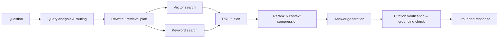

# NexusRAG

NexusRAG is an agentic knowledge-intelligence platform for grounded answers over PDF, DOCX, TXT, and Markdown documents. It combines vector and keyword retrieval, reciprocal-rank fusion, reranking, citation verification, and a grounding check.

## Architecture



The FastAPI backend uses PostgreSQL with pgvector in Docker (and supports SQLite for a lightweight local demo). The React/Vite UI provides document management, citation-aware chat, retrieval inspection, telemetry, and evaluation runs.

## Run with Docker (recommended)

1. Optionally copy `.env.example` to `.env` and set `LLM_API_KEY` plus `LLM_PROVIDER=openai`. Without it, Docker starts in `mock` LLM mode; it is useful for exercising the complete retrieval/UI path without a paid API key.
2. Run `docker compose up --build`.
4. Open `http://localhost:5173`. API docs are at `http://localhost:8000/docs`.
5. In a second terminal, load the included demo knowledge base with `python scripts/ingest_samples.py` (requires the backend dependencies installed locally), or upload the files in `sample_data/` through the UI.

Stop containers with `docker compose down`. Add `-v` only when you intentionally want to remove the persisted PostgreSQL and upload volumes.

## Run locally

Prerequisites: Python 3.12+, Node.js 20+, and (for the production data path) PostgreSQL with pgvector. Python 3.11 also works for the checked-in test setup.

```powershell
Copy-Item .env.example .env
# For a no-Docker demo, set DATABASE_URL="sqlite+aiosqlite:///./nexusrag.db" in .env
python -m pip install -r backend/requirements.txt
Set-Location backend
python -m uvicorn app.main:app --reload --port 8000
```

In another PowerShell window:

```powershell
Set-Location frontend
npm install
npm run dev
```

Then ingest the demo data (from the repository root):

```powershell
python scripts/ingest_samples.py
```

## Validation and evaluation

```powershell
Set-Location backend
python -m pytest -q
ruff check app tests
python -m app.evaluation.run
```

## Useful demo questions

- What is reciprocal rank fusion and why is it useful in hybrid retrieval?
- Compare the architectural trade-offs described for distributed systems and RAG systems.
- Summarize the recommended practices for reliable AI systems.
- What does the knowledge base say about quantum computing? (expects an evidence-limited response)

## Key environment variables

`DATABASE_URL`, `LLM_PROVIDER`, `LLM_MODEL`, `LLM_API_KEY`, `LLM_BASE_URL`, `EMBEDDING_PROVIDER`, `EMBEDDING_MODEL`, `RERANKER_TYPE`, `RERANKER_MODEL`, and `ALLOWED_ORIGINS` are documented in `.env.example`. Never commit `.env`.
